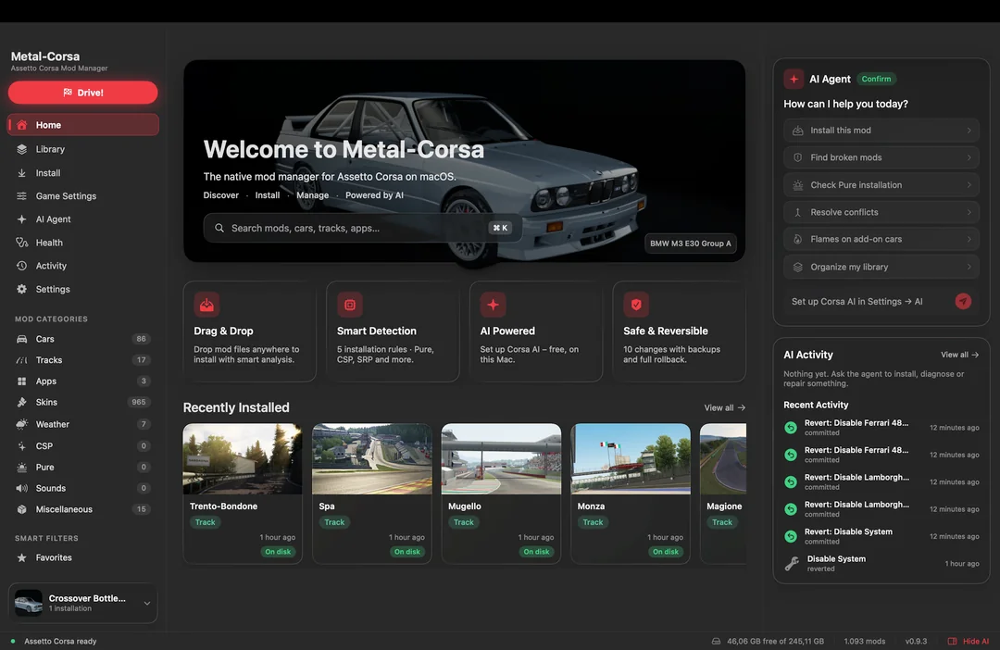

# Metal-Corsa

**A native Mac mod manager for Assetto Corsa running in CrossOver.**
Drop in mods, see where every file goes, and undo anything. No Content Manager, no Wine headaches.

### [⬇ Download the latest beta](https://github.com/Jamss-dev/metal-corsa-releases/releases)

Free closed beta · Apple Silicon · macOS 14+

---

## What it does

- **Drag & drop installs.** Zip, 7z, rar or a whole folder of mods. Metal-Corsa works out where every file goes (cars, tracks, CSP, Pure, Shutoko Revival Project, apps, skins, skydomes, ReShade shaders and presets) and shows you the plan before touching anything.
- **Undo anything.** Every install, uninstall and setting change is backed up and can be reverted from Activity.
- **Health check.** Finds common CrossOver problems (CSP not loading, missing fonts, broken or conflicting mods) and fixes most of them in one click.
- **Drive!** Pick car, skin, track and session (practice, race, track day with traffic) and start the game straight from the app. Join online servers too.
- **Game settings without the launcher.** Graphics incl. render scale and AMD FSR (via CSP), controls incl. CSP keys, Neck FX presets, live chase-cam tuning, Pure, skydomes, track skins.
- **Optional AI assistant** that can run fully on your Mac.

## Requirements

- Apple Silicon Mac (M1 or newer)
- macOS 14 Sonoma or later
- CrossOver 25, with Assetto Corsa from Steam already working in a bottle (Custom Shaders Patch doesn't work on CrossOver 26 yet)

Metal-Corsa doesn't include the game or any mods.

## Install

1. Download **Metal-Corsa.zip** from the [latest release](https://github.com/Jamss-dev/metal-corsa-releases/releases), unzip it and drag **Metal-Corsa.app** into Applications.
2. Beta builds aren't Apple-notarized yet, so macOS blocks the first launch ("can't be opened" or "damaged"). Open Terminal and paste:
   `xattr -dr com.apple.quarantine /Applications/Metal-Corsa.app && open /Applications/Metal-Corsa.app`
   Or try to open the app once, then go to **System Settings → Privacy & Security** and click **Open Anyway**.
3. Let it find your CrossOver bottle, then run **Health** once.

**Updates:** the app shows **Update available** when a new beta is out. Download it, replace the app in Applications and clear the warning again as in step 2. Your library, backups and settings stay.

## Feedback & bugs

Join the [Discord](https://discord.gg/STHzE5e886) and post in **#dev-log** with a screenshot of Health or Library and what you were doing.

## Known issues

- Showroom 3D preview: some cars show missing parts (e.g. doors) that look fine in game.
- Unusual mod packs may still be detected wrong. Check the plan before installing; everything can be undone.

---

Metal-Corsa is an unofficial tool, not affiliated with or endorsed by Kunos Simulazioni, 505 Games, CodeWeavers, or the authors of Custom Shaders Patch, Pure or Content Manager. Beta builds are pre-release software: keep your own backups of content you can't download again. The app is proprietary; see the in-app license. This repo contains downloads only, no source code.
